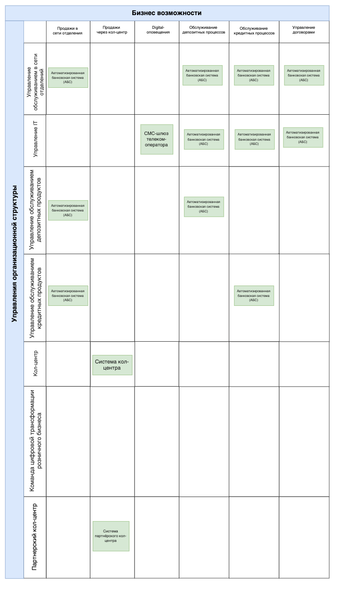
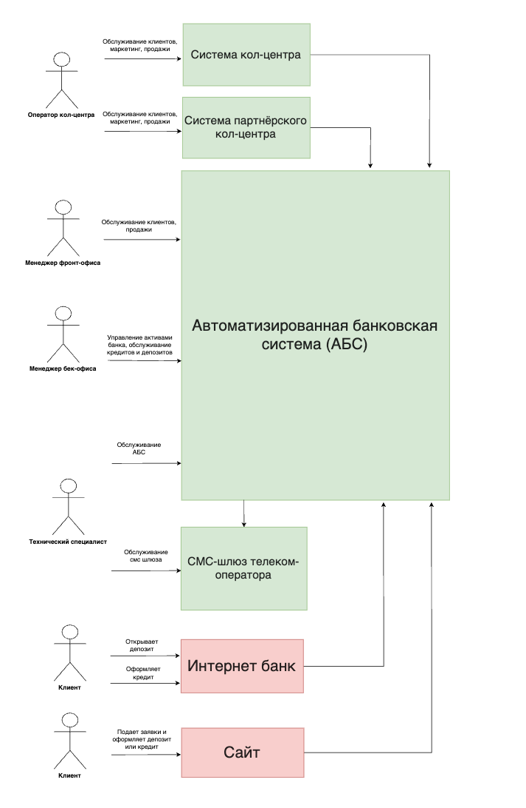

# Карта IT-ландшафта и схема интеграции приложений  

Карта текущего it ландшафта компании показывает it-системы банка, в которых пересекаются бизнес возможности, указанные 
в колонках, и элементы организационной структуры организации, указанные в строках.      

Схема интеграции приложений показывает взаимодействие текущих it-систем и интеграцию планируемых изменений.     
