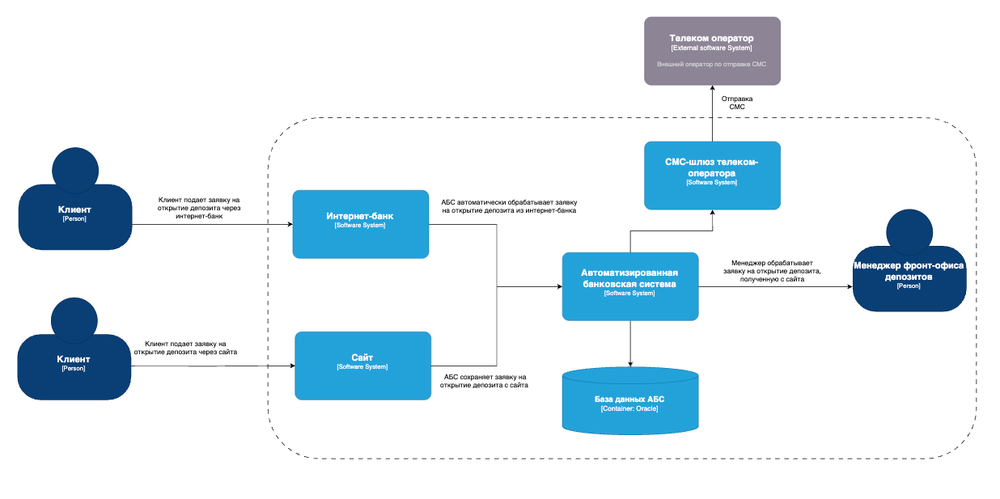
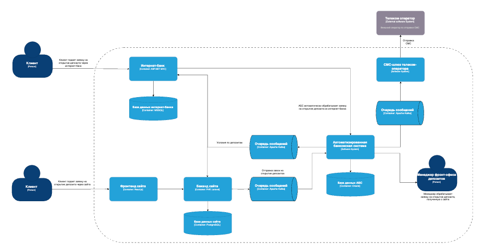

### **Название задачи:** Открытие депозитов онлайн
### **Функциональные требования**
Верхнеуровневые Use Cases в виде таблицы с пошаговым описанием:

| **№** | **Действующие лица или системы** | **Use Case**                                                                 | **Описание**                                                                                                                          |
|:-----:|:---------------------------------|:-----------------------------------------------------------------------------|:--------------------------------------------------------------------------------------------------------------------------------------|
|  UC1  | Клиент, сайт, АБС                | Клиент подает заявку на открытие депозита через сайта                        | Клиент предоставляет свои данные и подает заявку на открытие депозита. Система АБС формирует и передает заявку менеджеру фронт-офиса. |
|  UC2  | Менеджер фронт-офиса, АБС        | Менеджер обрабатывает заявку на открытие депозита с сайта                    | Менеджер фронт-офиса обрабатывает завку и связывается с клиентом.                                                                     |
|  UC3  | Клиент, интернет-банк, АБС       | Клиент подает заявку на открытие депозита через интернет-банк                | Клиент предоставляет свои данные и подает заявку на открытие депозита через интернет-банк. Система АБС получает завку.                |
|  UC4  | Интернет-банк, АБС               | АБС автоматически обрабатывает заявку на открытие депозита из интернет-банка | АБС автоматически обрабатывает заявку на открытие депозита из интернет-банка и отправляет ответ клиенту.                              |

### **Нефункциональные и архитектурно-значимые требования **

| Код    | Требования                                                                                                                                                                               | Комментарий                   |
|--------|------------------------------------------------------------------------------------------------------------------------------------------------------------------------------------------|-------------------------------|
| **U**  | **Удобство использования (Usability)**                                                                                                                                                   |                               |
| U1     | Интерфейс должен соответствовать принятым в компании цветам и брендированным элемантам                                                                                                   |                               |
| **R**  | **Надёжность (Reliability)**                                                                                                                                                             |                               |
| R1     | Данные должны передаваться по защищенному протоколу                                                                                                                                      |                               |
| R2     | В интернет-банке данные при передаче также надо передавать по защищенному протоколу                                                                                                      |                               |
| R3     | Все сервисы должны работать 24/7 и быть доступны в 99,9%                                                                                                                                 |                               |
| **P**  | **Производительность (Performance)**                                                                                                                                                     |                               |
| P1     | Предусмотреть возможность горизонтального и вертикального масштабирования всех компонентов                                                                                               |                               |
| P2     | Отклик по всем операциям должен быть максимально быстрым и занимать миллисекунды                                                                                                         |                               |
| **S**  | **Поддерживаемость (Supportability)**                                                                                                                                                    |                               |
| S1     | Должна быть поддержка интеграционного тестирования                                                                                                                                       |                               |
| **+R** | **+ Ограничения (Restricitions)**                                                                                                                                                        |                               |
| +R1    | При доработках во всех системах нужно как можно больше использовать технологии, которые уже есть в банке. Новые технологии должны быть совместимы с существующими платформами разработки |                               |
| +R2    | Для очередей сообщений использовать Kafka                                                                                                                                                |                               |

### **Диаграмма контекста**  
 

### **Диаграмма контейнеров**  
 

### **Альтернативы**    
Отказаться от платформы партнеров ASP.NET MVC и вести собственную разработку на Java/Go.
Разбить систему АБС на микросервисы с асинхронным взаимодействием, добавить возможность горизонтального масштабирования.    

### **Недостатки, ограничения, риски**
Есть риски и ограничения, связанные с центральной монолитной системой АБС, которая является высоконагруженной и 
не позволяет производить горизонтальное масштабирование.        

