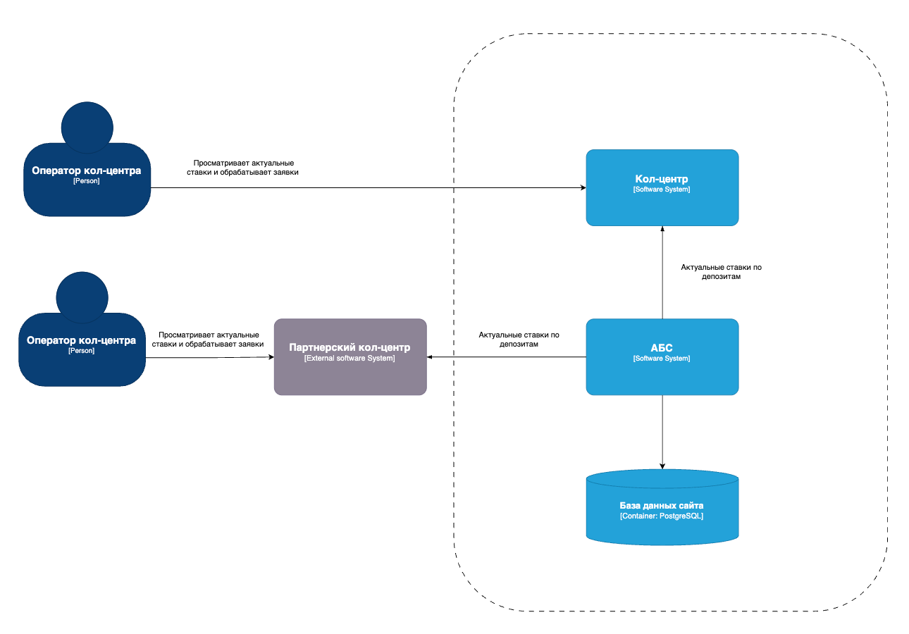
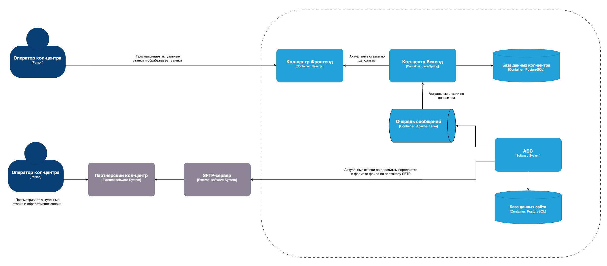
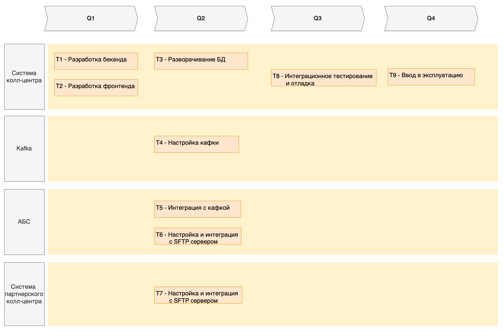

### **Передача актуальных ставок между банком и кол-центром**
### **Функциональные требования**
Верхнеуровневые Use Cases в виде таблицы с пошаговым описанием:

| **№** | **Действующие лица или системы**                        | **Use Case**                                                                          | **Описание**                                         |
|:-----:|:--------------------------------------------------------|:--------------------------------------------------------------------------------------|:-----------------------------------------------------|
|  UC1  | Оператор кол-центра, кол-центр, АБС                     | Оператор получает актуальные данные по депозитным ставкам через кол-центр             | АБС рассылает актуальные данные в кол-центр          |
|  UC2  | Оператор кол-центра, внешний партнерский кол-центр, АБС | Оператор получает актуальные данные по депозитным ставкам через партнерский кол-центр | АБС рассылает актуальные данные во внешний кол-центр  

### **Нефункциональные и архитектурно-значимые требования**

| **№** | **Требование**                                                           |
|:-----:| :----------------------------------------------------------------------- |
|  R1   | Режим работы 24/7                                                        |
|  R2   | Доступность сервисов 99,9%                                               |
|  R3   | Невозможно передать информацию по депозитом через API, только через файл |

### **Диаграмма контекста**

### **Диаграмма контейнеров**

### **Альтернативы**
Альтернативным решением является передача данных с актуальными ставками по депозитам во внешний партнерский сервис через очередь сообщений или 
реализовать Rest API.

### **Недостатки, ограничения, риски**
Решение требует доработки и усложняет АБС.

### **Road Map разработки и внедрения новой функциональности**

